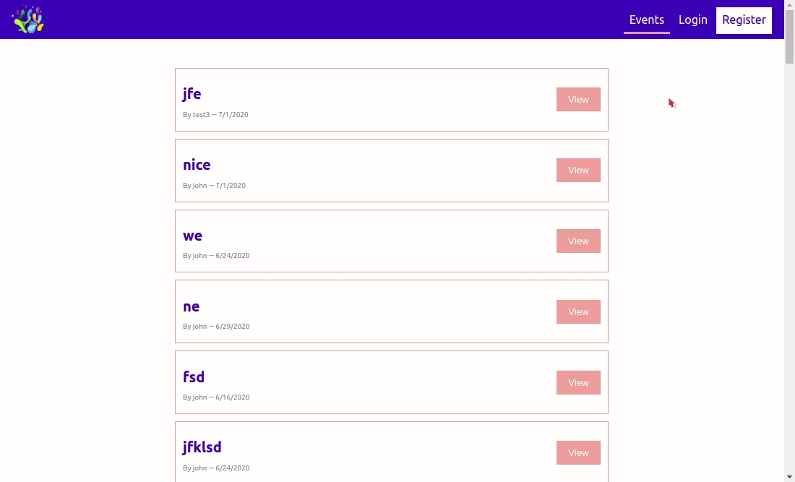

# Event App 

  

This is cool event app where event can be created, booked, cancel booking as well as User authentication.

  
[Live Demo](https://event-app2.herokuapp.com/)



## Getting Started

  

These instructions will get you a copy of the project up and running on your local machine for development and testing purposes.
  

### Prerequisites

  

First make sure you have install [Yarn Package](https://classic.yarnpkg.com/en/docs/install#debian-stable) manager which is really Cool, I personally shift from NPM to [Yarn](https://classic.yarnpkg.com/en/docs/install#debian-stable), cause NPM throws alot of error. so giving you change to learn something new!

  This is for Debian / Ubuntu, you can for your [machine here]:(https://classic.yarnpkg.com/en/docs/install#debian-stable)

```
curl -sS https://dl.yarnpkg.com/debian/pubkey.gpg | sudo apt-key add -
echo "deb https://dl.yarnpkg.com/debian/ stable main" | sudo tee /etc/apt/sources.list.d/yarn.list
```
Now update the package and install
```
sudo apt update && sudo apt install yarn
```

  

### Installing

  

Install the dependencies, run the below command in the project root directory:
 

```
yarn add *
yarn client
```
  

##### *Change the GraphQL Uri*

1) open the dirctory `client/src/helper/sender-hel.js` and change there `url: '/graphql` to `url: 'localhost:8000/graphql`
2) open the `server.js` file the uncomment the `graphiql: true`


  

## Running

  once the above pocess is completed, you should be good to go for seeing the demo of the app in your browser, run underneath command in the root directory:

```

yarn dev // for the back-end
yarn client // for the font-end

```
  

## Deployment

  

You can deploy this script wherever you like, but on the nodejs server only

  

## Built With

  

*  [ReactJs]([https://reactjs.org/](https://reactjs.org/)) - For UI
* [SCSS]([https://sass-lang.com/](https://sass-lang.com/)) - For the Styling

*  [React Router]([https://reacttraining.com/react-router/](https://reacttraining.com/react-router/) - For Handling URL, Routes
*  [ExpressJs]([https://expressjs.com/](https://expressjs.com/)) - For the Back End
*  [GraphQL]([https://graphql.org/](https://graphql.org/)) - For the Efficient DB request
* [Axios]([https://github.com/axios/axios](https://github.com/axios/axios)) - used to connect with endpoint (API)
*[JWT] - used to encrypt the password
 

## Acknowledgments

  
Credit to Max on youtube!